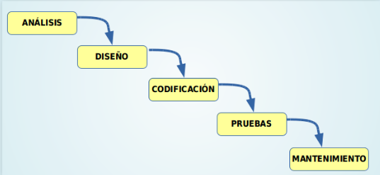
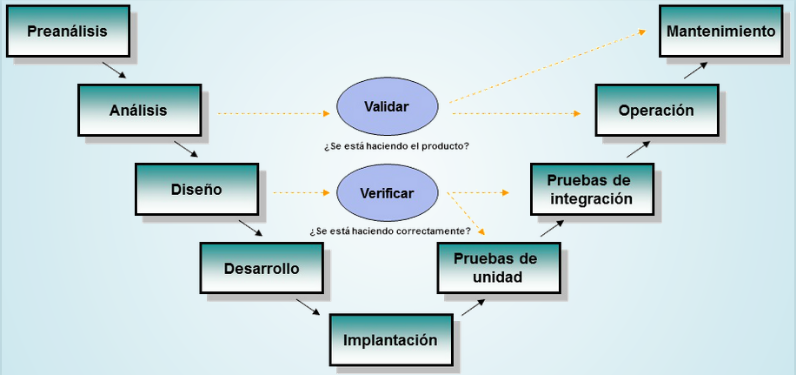
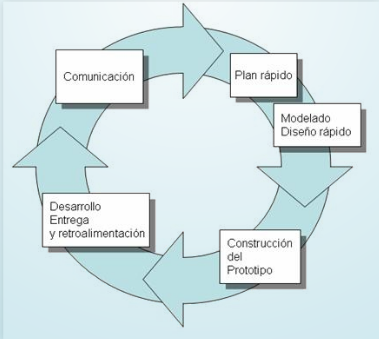
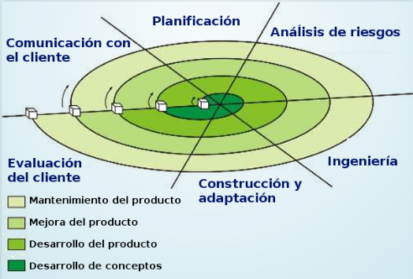
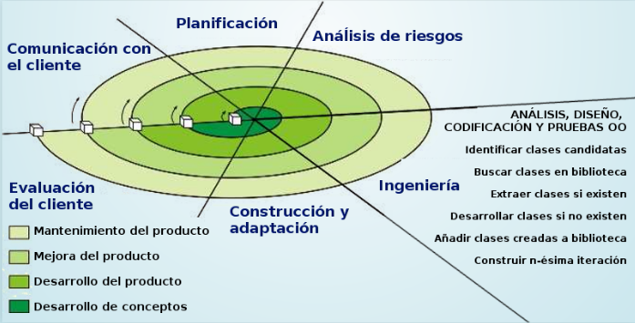
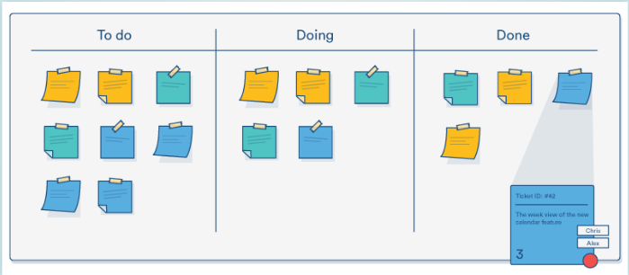

# Apunts_UF1_1

# Introducció:

## Tipus de Software:

Hi ha tres tipus de software:

- **De sistema** (sistema operatiu, drivers)
- **De aplicació** (Suite ofimàtic, Navegador, Edició de imatge, ...)
- **De desenvolupament** (Editors, copiladors, interpretes,...)

## Relació Hardware-Software:

- **Disc Dur:** guarda informació de forma permanent als arxius executables i els arxius de dades.

- **Memòria RAM:** emmagatzema de forma temporal el codi binari dels arxius executables i els arxius de dades necessaries.

- **CPU:**  Llegeix i executa instruccions emmagatzamades en memòria RAM.

- **E/S:** Agafa noves dades desde la entrada, es mostra els resultats, es llegeixen / guarden a disc...

## Tipus de Codi:

- **Codi font:** Arxiu de text llegible escrit en un llenguatge de programació.
- **Codi objecte:** (intermedi) Arxiu binari no executable.
- **Codi executable:** Arxiu binari executable.

# Cicle de vida del software:

## Ingeniería de software:

Disciplina que estudia els principis i metodologías per el desenvolupament i manteniment de sistema software.

- Alguns autors consideran que **desenvolupament de software** és un termini més apropiat que **ingeniería de software**.

## Desenvolupament de Software:

- **ANÀLISI**

    Es determina i defineix la necessitat del client i s'especifica els requisits que s'han de cumplir.

  - Ha de ser completa i sense omisions.
  - Ser concisa i sense trivialitats.
  - Ser entedible per el client
  - Separar requisits funcionals i no funcionals
  - Fixar criteris de validació

- **DISENY**

  - Es descompon i s'organitza el sistema en elements components que poden ser desenvolupats per separat.

  - Les activitats habituals són les següents:

  - Diseny arquitectónic
  - Diseny detallat
  - Diseny de dades
  - Diseny de interfície

- **CODIFICACIÓ**

  - S'escriu el codi font de cada component.
  - Poden utilitzar-se diferents llenguatges informàtics:
    - **LLenguatges de programació:** C, C++, Java, Javascript, ...
    - **LLenguatges d'un altre tipus:** HTML, XML, JSON, ...

- **PROVAS**

  - El principal objectiu de les proves te que ser conseguir que el programa funcioni incorrectement i que es descubreixin defectes.

  - Tenim que sometre el programa al màxim número de situacions diferents.

- **MANTENIMENT**

  - Durant l'explotació del sistema software es necessari realitzar canvis ocasionals.

  - Per això s'ha de tornar a fer part del treball realitzat en las fases previas.

  - Tipus de manteniment:
    - **Correctiu:** Es correigeixen defectes.
    - **Perfectiu:** Es millora la funcionalitat.
    - **Evolutiu:** S'afageix funcionalitats novas.
    - **Adaptatiu:** S'adapta a nous entorns.

## Models de desenvolupament de software:

- **Models clàssics (predicatius):**
  - Model en cascada
  - Model en V
- **Model de construcció de prototips**
- **Model evolutius o incrementals**
  - Model en espiral(iteratius)
  - Metodologías ágils (adaptatius)

### Model en cascada:

- Model de major atiguitat.
- Identifica las fases principals del desenvolupament de software.
- Las fases han de realitzar-se en el ordre correcte.
- El resultat de una fase en l'entrada de la següent fase.
- És un model bastant rígid que s'adapta malament al canvi continu de especificacions.
- Existeixen diferents variants amb major o menor cantitat d'activitats.

### Model en V:

- Model molt semblant al model cascada.
- Visió jerarquica amb diferents nivells.
- Els nivells superiors indican major abstracció.
- Els nivells inferiors indican major nivell de detall.
- El resultat de una fase es la entrada de la següent fase.
- existeixen diferents variants amb major o menor cantitat d'activitats.

### Prototips:

- Sobint els requisits no estàn especificats clarament:
  - per no existir experiència prèvia.
  - per omisió o falta de concreació del usuari/client

- Procés:
  - Es crea un prototip durant la **fase d'anàlisi** i es prova per l'usuari/client per refinar els requisits del software a desenvolupar.
  - Es repeteix el pas anterior las vegades necessaries.

- Tipus de prototips:
  - **Prototips ràpids**
    - El prototip pot estar desenvolupat utilitzan un altre llenguatge i/o eines.
  - **Prototips evolutius**
    - El prototip està dissenyat en el mateix llenguatge i eines del projecte.
    - El prototip s'utilitza com a base per a desenvolupar el projecte.

### Model en espiral:

- Desenvolupat per Boehm en 1988.
- L'activitat **d'ingeniería**correspon a las fases dels models clàssics: anàlisi, diseny, codificació,...

**APLICAT A LA PROGRAMACIÓ ORIENTADA A OBJECTES**

- En l'activitat de **ingeniería** es dona gran importància a la reutilització de codi.

### Metodologías àgils

- Són mètodes de ingeniería del software basats en el desenvolupament iteratiu e incremental.
- El treball es realitza mitjançant la col·laboració d'equips organitzats i disciplinats.
- Les metodologías més conegudes són:
  - Kanban
  - Scrum
  - XP (eXtreme Programming)

#### KANBAN:

- Tambè conegut per sistema de tarjes.
- Desenvolupat per Toyota per la industria de fabricació de productes.
- enfocat a entregar el màxim valor per els clients.

#### SCRUM:

- Model de desenvolupament incremental.

